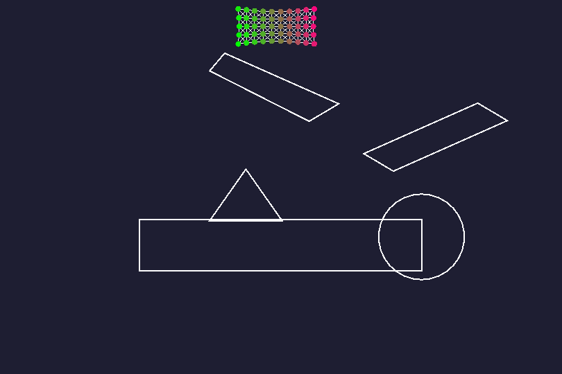

# softbody
 Softbody simulation using a spring model.

## How does it work ?
This simulation uses the Euler's integration for moving each dot of the softbody. The springs in the soft body use the Hooke's law for applying forces. Finally, the convex shapes collisions are handled using a raycasting algorithm. The simulation also provides a way to create new shapes.

## Controls
- Space : Pause the simulation
- Up/Down : Chnage the simulation precision
- R : restart the simulation
- Left click : move the softbody toward the mouse
- Right click : add a new vertex to the current shape
- T : add the current shape to the simulation
- Middle click : delete the shape closest to the mouse
